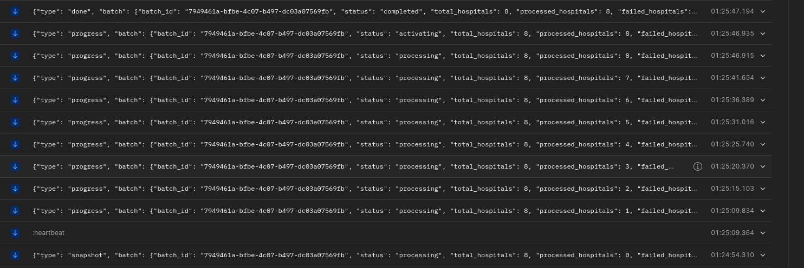

# Hospital Bulk Processing System

A bulk-ingestion system that sits in front of an existing **Hospital Directory API**: upload a CSV, and it creates + activates hospitals as a single batch, with real-time progress. Two independent, separately-dockerized projects:

- **`bulk-hospital-processor/`** — Flask backend (async processing, Redis, SSE).
- **`hospital-bulk-ui/`** — React (Vite) single-page client served by nginx.

---

## Key features

- **Bulk CSV upload** — `POST /hospitals/bulk` (multipart), header `name,address,phone` (phone optional), max 20 rows.
- **Asynchronous processing** — uploads return `202` immediately; an RQ worker creates each hospital downstream under one batch id, then activates the whole batch once all succeed.
- **Real-time progress (SSE)** — `GET /hospitals/bulk/{id}/events` streams live `snapshot → progress → done` events; UI shows a live progress bar + per-row table, with automatic polling fallback.
- **Resume** — `POST /hospitals/bulk/{id}/resume` retries only pending/failed rows and re-attempts activation; idempotent and crash-safe.
- **Status & history** — `GET /hospitals/bulk/{id}` and `GET /hospitals/batches`.
- **Swagger UI** — interactive API docs at `/docs`.
- **Comprehensive logging** — every line stamped with `batch_id`; stdout + rotating file.
- **Fully dockerized** — `docker compose up` for each project.

---

## Design choices

- **Async via RQ + Redis** — keeps the upload request fast and lets processing survive restarts; Redis is the single store for batch state, parsed rows, per-row results, and the job queue.
- **Resumability** — progress is persisted to Redis after every row, so resume skips already-created rows; a best-effort reconciliation against `GET /hospitals/batch/{id}` (matched by name+address) guards against duplicates if a crash happened mid-create.
- **Activation policy** — the batch is activated only when *all* rows succeed; otherwise it ends `partially_failed` and is left for resume (no partial activation).
- **SSE over WebSockets** — progress is one-directional, so SSE is simpler (plain HTTP, no extra deps, proxy- and `curl`-friendly) yet truly real-time. Worker → Redis Pub/Sub → web process → clients keeps producers/consumers decoupled across processes.
- **`gthread` gunicorn workers** — long-lived SSE streams use threads instead of tying up whole worker processes.
- **nginx reverse proxy (frontend)** — SPA calls backend routes directly (e.g., `/hospitals/bulk`). In production nginx proxies selected API paths to the backend; in development the UI can call an absolute backend URL via `VITE_API_BASE_URL`. `proxy_buffering off` so SSE flushes live.
- **Backend usable independently** — the API (including the SSE stream) works with any HTTP client; the frontend is optional.

---

## Architecture

```
                  ┌────────────┐  enqueue   ┌──────────┐         ┌──────────────┐
 CSV ─► React UI ─► Flask API  │ ─────────► │ RQ queue │ ──────► │  RQ worker   │
 (nginx /api)     │ (gunicorn) │            │ (Redis)  │         │ process_batch│
                  └─────┬──────┘            └──────────┘         └──────┬───────┘
                        │  state / results / pub-sub                    │ HTTP (retries)
                        ▼                                               ▼
                  ┌────────────┐  SSE events (Redis Pub/Sub)   ┌────────────────────────┐
                  │   Redis    │ ◄──────── progress ───────────│ Downstream Hospital API│
                  └────────────┘                               │ POST /hospitals/ ...    │
                                                               └────────────────────────┘
```

---

## Tech stack

- **Backend:** Python 3.11, Flask + Flask-RESTX, RQ, Redis, requests, gunicorn.
- **Frontend:** React 18, Vite, nginx (runtime).
- **Infra:** Docker + docker compose; Redis 7.

---

## How to run (Docker)

Run the backend first (publishes port `8080`), then the UI.

- **Backend**
  ```bash
  cd bulk-hospital-processor
  cp .env.example .env        # set EXTERNAL_API_BASE_URL to your deployed API
  docker compose up --build
  ```
  - API: http://localhost:8080 · Swagger: http://localhost:8080/docs · Health: http://localhost:8080/health
  - Starts `redis`, `web` (gunicorn) and `worker` (RQ).

- **Frontend**
  ```bash
  cd hospital-bulk-ui
  docker compose up --build
  ```
  - UI: http://localhost:3000
  - nginx proxies backend routes (e.g., `/hospitals/...`, `/batches`, `/docs`, `/health`) directly to `BACKEND_URL` (default `http://host.docker.internal:8080`). Set `BACKEND_URL=http://web:8080` to share the backend's compose network instead.

- **Smoke test**

  Bash
  ```bash
  curl -F "file=@backend/samples/hospitals.csv" http://localhost:8080/hospitals/bulk -> returns batch id curl -N http://localhost:8080/hospitals/bulk/<batch_id>/events   # live progress
  ```

  Postman
  

## Local dev (without Docker)

- **Backend:** `pip install -r requirements.txt`, run Redis, then `python worker.py` and `gunicorn wsgi:app` (or `python wsgi.py`).
- **Frontend:** `npm install && npm run dev` (http://localhost:3000).

## Configuration (key env vars)

- **Backend** (`bulk-hospital-processor/.env`)
  - `EXTERNAL_API_BASE_URL` — downstream Hospital API base URL.
  - `REDIS_URL` — defaults to the compose `redis` service.
  - `MAX_CSV_HOSPITALS` (20), `HTTP_MAX_RETRIES` (3), `BATCH_TTL_SECONDS` (7d), `LOG_LEVEL`.
- **Frontend** (`hospital-bulk-ui/.env`)
  - `BACKEND_URL` — backend the nginx container proxies API routes to.
  - `VITE_API_BASE_URL` — (dev only) absolute backend URL for the Vite dev server to call directly (e.g., `http://localhost:8080` or `https://backend.example.com`). If unset, the client assumes the backend is at the same origin.

---

## Swagger UI

The backend serves interactive API documentation at `/docs`.

Deployed


Local

- Visit `http://localhost:8080/docs` after starting the backend.
- Use the Swagger page to inspect endpoints, try request bodies, and execute API calls directly.

## UI screenshots

The frontend provides a simple upload flow and real-time progress view.

Deployed


Local

- Visit `http://localhost:3000/` after starting the ui client.
- Upload CSV → batch creation starts asynchronously.
- Live progress bar and per-row result table update as hospitals are created.


---

## API summary (this service)

| Method | Path | Purpose |
|--------|------|---------|
| `POST` | `/hospitals/bulk` | Upload CSV; returns `202` + `batch_id` |
| `GET`  | `/hospitals/bulk/{batch_id}` | Batch status + per-row results |
| `GET`  | `/hospitals/bulk/{batch_id}/events` | Real-time progress (SSE) |
| `POST` | `/hospitals/bulk/{batch_id}/resume` | Resume an interrupted/failed batch |
| `GET`  | `/hospitals/batches` | List recent batches |
| `GET`  | `/health` | Liveness + Redis check |

> Downstream API consumed: `POST /hospitals/`, `PATCH /hospitals/batch/{id}/activate`, `GET /hospitals/batch/{id}`.

---

